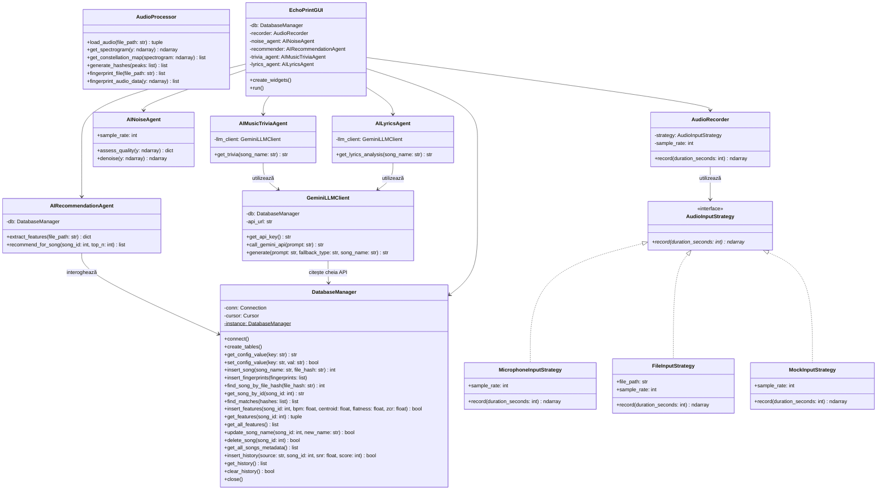

# 🎙️ EchoPrint (PyShazam)

[](https://www.python.org/)
[](https://www.sqlite.org/)
[](https://docs.python.org/3/library/tkinter.html)
[](https://aistudio.google.com/)
[](https://librosa.org/)

**EchoPrint** 是一款使用 Python 开发的桌面音频识别应用程序，其灵感来源于 Shazam 所使用的频谱指纹（Spectral Fingerprinting）算法。本项目是为布加勒斯特大学数学与计算机科学学院（FMI Unibuc）的**软件开发方法学（MDS）**课程开发，符合学术要求和软件工程标准。

该应用程序可以扫描并“学习”本地音乐库中的歌曲（生成高效存储在 SQLite 中的频谱指纹），然后实时识别麦克风录制的实时声音或从文件中加载的歌曲。它还使用自主 AI 代理进行背景噪音消除、生成相似推荐，并通过大语言模型（LLM）提取音乐百科/歌手传记和分析歌词。

---

## ✨ 核心功能

该应用围绕四个核心支柱构建：

### 1. 算法音频识别
*   **灵活的输入策略**：支持直接从物理麦克风录音、读取现有音频文件（MP3、WAV、FLAC 等）或生成用于测试的模拟音频流（通过 *策略模式 Strategy Pattern* 实现）。
*   **数字信号处理 (DSP)**：利用 `librosa` 库进行快速傅里叶变换 (FFT) 来生成频谱图。
*   **星座图与哈希 (Constellation Map & Hashing)**：提取频谱图中的局部最大值点（峰值），并基于频率和时间偏移形成哈希对，实现超快速检索。

### 2. 数据库管理 (CRUD)
*   **可视化界面**：在 Tkinter 的 `Treeview` 表格中显示所有已存储的歌曲。
*   **动态过滤**：用户在输入歌曲名称时，数据库会进行实时即时搜索过滤。
*   **删除与修改**：直接在界面中重命名已保存歌曲的显示名称，或将其完全删除（通过 SQLite 的 `ON DELETE CASCADE` 级联约束自动清除相关的指纹和 AI 特征数据）。

### 3. 搜索历史与监控
*   自动将每次识别尝试记录到 `search_history` 表中。
*   监控技术参数：日期/时间、使用的音频源、识别出的歌曲、估计的信噪比 (SNR) 以及置信度分数（匹配的哈希数量）。
*   支持直接从界面中清空所有搜索历史。

### 4. 人工智能代理 (AI Agents)
该应用程序使用 **4 个自主 AI 代理**协同工作：
*   🧼 **AI 降噪与音质代理 (`AINoiseAgent`)**：评估原始音频质量（SNR、RMS、削波），并在分析前通过频谱门限（*Spectral Gating / Subtraction*）消除静态背景噪音。
*   🎵 **AI 音乐推荐代理 (`AIRecommendationAgent`)**：提取速度（BPM）和频谱音色（平坦度、质心、过零率），使用归一化欧几里得距离推荐数据库中前 3 首相似的歌曲。
*   💡 **AI 音乐百科代理 (`AIMusicTriviaAgent`)**：使用 Gemini LLM 提供关于该歌曲的趣味小常识和歌手的简短传记。
*   📝 **AI 歌词分析代理 (`AILyricsAgent`)**：使用 Gemini LLM 分析歌词的主要情感，并生成翻译好的歌词概要。

---

## 🏗️ 架构与设计模式

项目采用模块化设计，确保职责解耦：

```
PyShazam/
│
├── main.py                # 入口文件（CLI 解析器与 GUI 启动器）
├── echoprint.db           # 自动生成的 SQLite 数据库
├── requirements.txt       # Python 依赖库列表
│
├── audio/                 # 音频处理包
│   ├── audio_processor.py # FFT、星座图与频谱哈希算法
│   ├── audio_source.py    # 音频输入策略（策略模式）
│   └── recorder.py        # 音频录制实用程序类
│
├── db/                    # 数据持久化包
│   └── db_manager.py      # SQLite 数据库管理器（单例模式）
│
├── ai/                    # AI 代理逻辑包
│   ├── ai_noise_agent.py          # 音质分析与降噪代理
│   ├── ai_recommendation_agent.py # 特征提取与相似度推荐代理
│   ├── llm_client.py              # 用于 Gemini API 的安全 HTTP 客户端
│   ├── ai_trivia_agent.py         # 音乐百科代理（LLM）
│   └── ai_lyrics_agent.py         # 歌词与情感分析代理（LLM）
│
├── gui/                   # 图形用户界面包
│   └── gui.py             # 基于 Tkinter 的深色主题 GUI 界面
│
└── tests/                 # 自动化测试包
    ├── test_audio_processor.py
    ├── test_db_manager.py
    └── test_ai_agents.py
```

### 使用的设计模式：
1.  **单例模式 (`DatabaseManager`)**：SQLite 连接仅实例化一次并在整个应用程序中共享，以防止多线程之间的数据库文件锁定和写入冲突。
2.  **策略模式 (`AudioInputStrategy`)**：将 `AudioRecorder` 与物理音频输入源解耦。在运行时或测试中可以动态注入 `MicrophoneInputStrategy`、`FileInputStrategy` 或 `MockInputStrategy`，而无需修改录音逻辑。

### UML 类图：


---

## ⚙️ 环境要求与依赖

在运行项目之前，请确保已安装以下内容：
*   **Python 3.10+** (可从官方网站或 Microsoft Store 下载)。
*   **FFmpeg** (由 `librosa` / `soundfile` 在后台使用以解码音频文件)。应用程序将在首次运行时尝试使用 `static_ffmpeg` 包自动下载并配置静态 FFmpeg 路径。
*   **工作麦克风** (用于实时录音识别)。
*   *(可选)* 免费的 **Google Gemini** API 密钥以使用真实的 LLM 代理功能。可以从 [Google AI Studio](https://aistudio.google.com/) 免费生成。在没有密钥的情况下，应用程序将使用完全集成的本地 **Mock 离线** 系统。

---

## 🚀 安装与配置

### 步骤 1：下载并进入项目目录
在命令行中进入项目所在的文件夹：
```cmd
cd "C:\Users\jeanl\OneDrive\Desktop\MDS\PyShazam"
```

### 步骤 2：创建并激活虚拟环境 (`venv`)
建议将应用程序的依赖项隔离在虚拟环境中：
```cmd
# 创建虚拟环境
python -m venv venv

# 在 Windows (命令提示符 CMD) 中激活虚拟环境
venv\Scripts\activate.bat

# 在 Windows (PowerShell) 中激活虚拟环境
.\venv\Scripts\Activate.ps1
```

### 步骤 3：安装必要的依赖库
在虚拟环境激活状态下，安装 `requirements.txt` 中列出的依赖包：
```cmd
pip install -r requirements.txt
```

### 步骤 4：配置 Gemini API 密钥
你可以直接从桌面图形用户界面添加 API 密钥：
1. 启动 GUI 应用程序。
2. 进入 **"Setări / Învață Melodii"** (设置与学习) 标签页。
3. 在专用的 **"Gemini API Key"** 输入框中填入密钥，然后点击 **"Salvează Cheie API"** (保存 API 密钥)。该密钥将安全地存储在 SQLite 中，并在以后的搜索中自动重用。

---

## 🖥️ 运行指南

该应用程序支持两种运行模式：

### A. 使用 GUI 模式运行 (桌面图形界面) - 推荐
这是默认的启动方式。运行以下命令启动深色主题的图形用户界面：
```cmd
python main.py
# 或者显式指定
python main.py --gui
```

**GUI 界面使用说明：**
1.  **Tab 1 (Recunoaștere - 识别)**：允许选择输入源（麦克风、文件或用于测试的模拟信号）。点击 **"Ascultă / Recunoaște"** (录音并识别) 开始录音。识别成功后，相似推荐、歌手百科和歌词情感分析将自动在下方的专用面板中显示。
2.  **Tab 2 (Administrare DB - 数据库管理)**：显示已学习的歌曲。你可以在表中进行即时过滤搜索、重命名所选歌曲或将其删除。
3.  **Tab 3 (Istoric Căutări - 搜索历史)**：显示保存在数据库中的技术查询历史，并允许将其清空。
4.  **Tab 4 (Setări & Învățare - 设置与学习)**：允许配置 API 密钥并可视化导入学习本地的音乐文件夹。

---

### B. 使用 CLI 模式运行 (命令行界面)
如果你更喜欢终端操作，可以运行专用命令：

1.  **学习模式 (索引本地音乐文件夹)**：
    递归扫描本地文件夹，生成频谱指纹和 AI 特征值并保存到 SQLite 数据库中：
    ```cmd
    python main.py learn --dir "C:\Calea\Catre\Muzica"
    ```
2.  **听歌识别模式 (直接在终端识别)**：
    *   *通过麦克风录音* (录音并识别 10 秒)：
        ```cmd
        python main.py listen --duration 10
        ```
    *   *通过音频文件*：
        ```cmd
        python main.py listen --file "C:\Calea\Catre\melodie.mp3"
        ```
    *   *通过模拟测试信号* (用于在没有物理麦克风时测试识别逻辑)：
        ```cmd
        python main.py listen --mock
        ```

---

## 🧪 自动化测试

该应用程序包含一套由 **23 个自动化单元测试** 组成的测试套件，可独立验证音频处理、指纹提取算法、数据库的单例行为、CRUD 操作、搜索历史以及 LLM 代理在真实和离线 Mock 情况下的正常运行。

运行完整的自动化测试套件命令：
```cmd
python -m unittest discover -s tests -p "test_*.py"
```

---

## ⚠️ 常见问题与调试 (Troubleshooting)

### 1. Windows 终端中的中文或特殊字符编码问题
如果在 Windows CMD/PowerShell 控制台中由于中文字符或罗马尼亚语字符而出现 `UnicodeEncodeError: 'charmap' codec can't encode...` 类型的编码错误，请在启动时通过设置环境变量强制终端使用 UTF-8 编码：
```cmd
set PYTHONUTF8=1
python main.py listen
```

### 2. SQLite 的多线程冲突错误 (`sqlite3.ProgrammingError`)
如果遇到在 GUI 线程与后台处理线程同时读写数据库时的错误，请确保 DatabaseManager 在创建连接时包含了 `check_same_thread=False` 参数。此修复已在代码中默认实现：
```python
self.conn = sqlite3.connect(self.db_path, check_same_thread=False)
```

### 3. Gemini API 发生 HTTP 404 或 429 错误
如果因为网络或配额限制导致 Gemini LLM 调用失败，应用程序将自动无缝切换到 **离线 Mock 模式**，并在 GUI 面板中展示本地生成的相关文本，以确保用户体验的连续性。默认推荐的 LLM 模型为 **`gemini-2.5-flash-lite`** (v1 终结点)，它在免费层账户中具有最快的响应速度和最佳稳定性。

<!-- Test commit for username update -->
