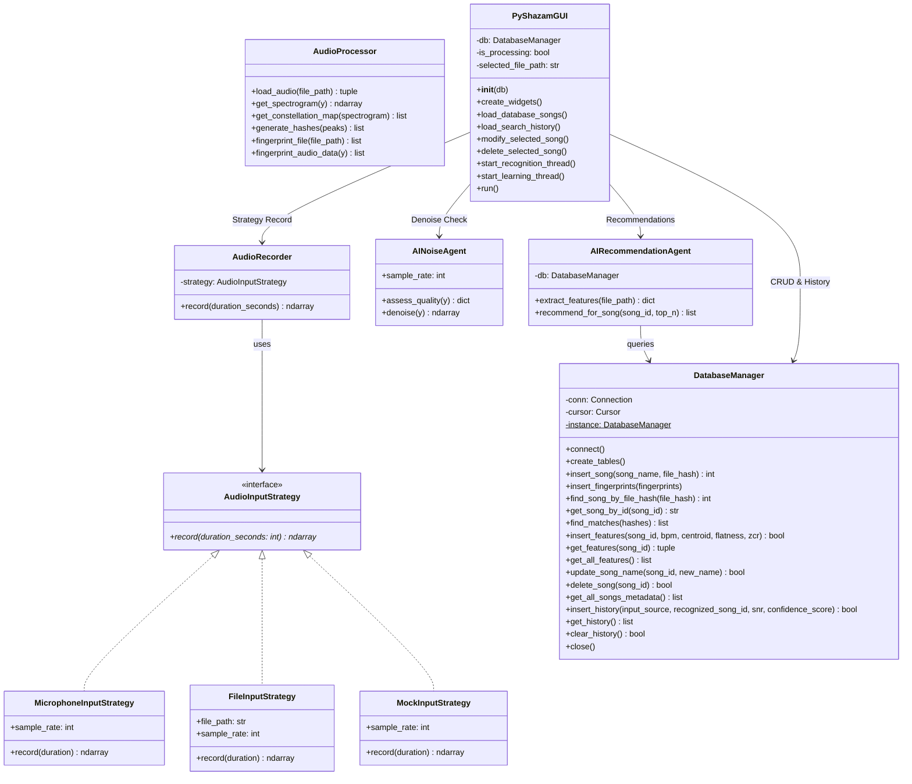

# PyShazam (MDS Project)

PyShazam este o aplicație de recunoaștere audio dezvoltată în Python, inspirată de algoritmul de fingerprinting utilizat de Shazam. Proiectul este structurat conform cerințelor academice și specificațiilor oficiale pentru disciplina **Metode de Dezvoltare Software (MDS)** de la FMI Unibuc.

Aplicația scanează și „învață” melodii dintr-o bibliotecă muzicală locală (generând amprente spectrale), iar apoi poate recunoaște o melodie ascultată live prin microfon sau dintr-un fișier, curățând zgomotul de fundal cu AI, oferind recomandări similare și logând rezultatele într-un istoric persistat în baza de date.

---

## 🏗️ Structura Proiectului & Diagrama UML

Proiectul respectă o arhitectură modulară, separând procesarea digitală a semnalelor, managementul persistenței, controlul dispozitivelor fizice și logica agenților de inteligență artificială.

### Diagrama de Clase (Mermaid UML)


---

## 🛠️ Specificații Proiect Implementate (Conform Fișei)

Aplicația implementează în totalitate specificațiile din fișa oficială a proiectului:

1. **Stocarea melodiilor într-o bază de date**: Baza de date SQLite (`shazam_clone.db`) păstrează melodiile, amprentele unice și caracteristicile AI.
2. **Adăugarea, ștergerea și modificarea intrărilor**:
   - *Adăugare*: Prin tab-ul de învățare sau din CLI.
   - *Ștergere*: Ștergerea completă a unei melodii și a amprentelor/trăsăturilor sale asociate direct din tabel (cu constrângere `ON DELETE CASCADE` activată).
   - *Modificare*: Redenumirea numelui de afișare al oricărei melodii salvate.
3. **Vizionarea bazei de date în funcție de filtre**: Tab-ul de Administrare conține un tabel `Treeview` cu un câmp de căutare dinamic care filtrează în timp real melodiile pe măsură ce utilizatorul tastează litere din nume.
4. **Interfață grafică pentru utilizator (GUI)**: Dezvoltată în Tkinter cu un aspect premium de tip *Dark Theme*. Permite:
   - Selectarea sursei audio (Microfon fizic, Fișier din PC sau Simulare test/Mock).
   - Înregistrarea live și monitorizarea calității audio.
   - Învățarea folderelor prin selectare vizuală.
5. **Formarea unui istoric de căutări**: Tabela `search_history` din SQLite salvează automat fiecare recunoaștere (data/ora, sursa audio, piesa identificată/eșuată, SNR estimat și scor de încredere). Istoricul este afișat într-un tabel dedicat în GUI și poate fi golit oricând.
6. **Design Patterns**: 
   - **Singleton** (`DatabaseManager`) pentru o conexiune sigură și unică.
   - **Strategy** (`AudioInputStrategy`) pentru flexibilitatea sursei audio (utilă în special la testare fără microfon).

---

## 🧠 Agenți de Inteligență Artificială (AI Agents)

Aplicația integrează **2 agenți AI** autonomi:

1. **AI Noise & Quality Agent (`AINoiseAgent`)**:
   - Evaluează RMS, distorsiunile și raportul SNR.
   - Aplică atenuare spectrală (*spectral subtraction / gating*) pentru eliminarea zgomotului static de fundal înainte de recunoaștere.

2. **AI Recommendation Agent (`AIRecommendationAgent`)**:
   - Extrage tempo-ul (BPM) și timbrul spectral în timpul indexării melodiei.
   - Recomandă top 3 piese similare folosind distanța euclidiană a vectorilor normalizați (Min-Max).

---

## 🚀 Instalare și Rulare

### Dependențe
1. Asigură-te că ai instalat Python 3.10+.
2. Instalează pachetele listate în `requirements.txt`:
   ```bash
   pip install -r requirements.txt
   ```

### Lansare Interfață Grafică (GUI)
Pentru a lansa interfața grafică desktop (implicit dacă nu se trimit argumente):
```bash
python main.py --gui
# sau simplu
python main.py
```

### Rulare mod CLI (Command Line Interface)
- **Modul Învățare**:
  ```bash
  python main.py learn --dir /calea/catre/muzica
  ```
- **Modul Ascultare**:
  ```bash
  python main.py listen --duration 10
  ```

---

## 🧪 Testare Unitară

Pentru rularea celor 18 teste unitare automate (ce acoperă integral logica audio, Singleton-ul DB, operațiile CRUD de ștergere/modificare, istoricul și agenții AI):

```bash
python -m unittest discover -s tests -p "test_*.py"
```
