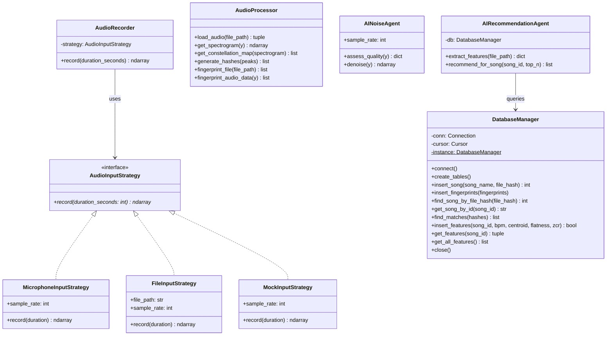

# PyShazam (MDS Project)

PyShazam este o aplicație de recunoaștere audio dezvoltată în Python, inspirată de algoritmul de fingerprinting utilizat de Shazam. Proiectul este structurat conform cerințelor academice pentru disciplina **Metode de Dezvoltare Software (MDS)** de la FMI Unibuc.

Aplicația scanează și „învață” melodii dintr-o bibliotecă muzicală locală (generând amprente spectrale), iar apoi poate recunoaște o melodie ascultată live prin microfon sau dintr-un fișier, curățând zgomotul de fundal și recomandând ulterior melodii similare din baza de date.

---

## 🏗️ Structura Proiectului & Diagrama UML

Proiectul respectă o arhitectură modulară, separând procesarea digitală a semnalelor, managementul persistenței, controlul dispozitivelor fizice și logica agenților de inteligență artificială.

### Diagrama de Clase (Mermaid UML)


---

## 🛠️ Design Patterns Utilizate

Pentru a asigura calitatea, testabilitatea și conformitatea cu bunele practici OOP cerute în cadrul disciplinei MDS, am implementat următoarele modele de design:

1. **Singleton Pattern (`DatabaseManager`)**:
   - Asigură crearea unei singure conexiuni active la baza de date SQLite (`shazam_clone.db`) pe parcursul execuției programului, evitând accesul concurent sau blocajele de conexiune.
   - Implementat prin suprascrierea metodei `__new__` în Python.

2. **Strategy Pattern (`AudioInputStrategy`)**:
   - Permite decuplarea logicii de înregistrare audio de restul aplicației.
   - Astfel, sursa de audio poate fi schimbată dinamic la runtime: înregistrare live de la microfon (`MicrophoneInputStrategy`), încărcarea unui fișier audio preînregistrat (`FileInputStrategy`) sau simularea unui semnal artificial pentru teste automate (`MockInputStrategy`), eliminând dependența de un microfon fizic în mediile de testare.

---

## 🧠 Agenți de Inteligență Artificială (AI Agents)

Aplicația integrează **2 agenți AI** autonomi care lucrează pe baza caracteristicilor spectrale ale sunetului:

1. **AI Noise & Quality Agent (`AINoiseAgent`)**:
   - **Analiza Calității**: Evaluează RMS (volumul), clipping-ul (distorsiunile) și SNR-ul estimat (Signal-to-Noise Ratio) raportat la zgomotul de fundal. Returnează un raport (`EXCELLENT`, `NOISY`, `DISTORTED`, `TOO_LOW`).
   - **Denoising**: Aplică o filtrare prin *spectral subtraction (spectral gating)* în domeniul frecvență (STFT) pentru a atenua automat zgomotul static alb/roz, asigurând o potrivire de mare precizie în baza de date chiar și în condiții de zgomot.

2. **AI Recommendation Agent (`AIRecommendationAgent`)**:
   - **Extracție de Caracteristici**: În timpul învățării melodiei, agentul extrage caracteristici fundamentale: tempo (BPM), *Spectral Centroid* (strălucirea/timbrul), *Spectral Flatness* (zgomotozitatea) și *Zero Crossing Rate*.
   - **Recomandări Similare**: La identificarea cu succes a unei melodii, agentul normalizează vectorii de trăsături folosind *Min-Max scaling* și calculează distanța euclidiană față de restul melodiilor din baza de date, returnând top 3 cele mai similare melodii.

---

## 🚀 Instalare și Rulare

### Dependențe
1. Asigură-te că ai instalat Python 3.10+.
2. Instalează pachetele listate în `requirements.txt`:
   ```bash
   pip install -r requirements.txt
   ```

### 1. Modul "Learn" (Învățare)
Scanează un folder local, extrage amprentele melodiei și trăsăturile AI pentru recomandări:
```bash
python main.py learn --dir /calea/catre/muzica
```

### 2. Modul "Listen" (Recunoaștere)
- **Ascultă la microfon (implicit)**:
  ```bash
  python main.py listen --duration 10
  ```
- **Folosește un fișier audio (util pentru teste/demo fără microfon)**:
  ```bash
  python main.py listen --file calea/catre/inregistrare.wav
  ```
- **Folosește semnal simulat (mock)**:
  ```bash
  python main.py listen --mock
  ```

---

## 🧪 Testare Unitară

Pentru rularea suitei complete de teste unitare automate (fără a fi necesar un microfon fizic mulțumită strategiei `MockInputStrategy`):

```bash
python -m unittest discover -s tests -p "test_*.py"
```

Testele acoperă:
- `test_audio_processor.py`: generarea spectrogramelor, a constellation map-ului și a hash-urilor.
- `test_db_manager.py`: funcționarea Singleton-ului, stocarea fingerprint-urilor, persistența și citirea features-urilor AI.
- `test_ai_agents.py`: corectitudinea evaluării calității audio, a funcției de denoising și a similarității în recomandările AI.
