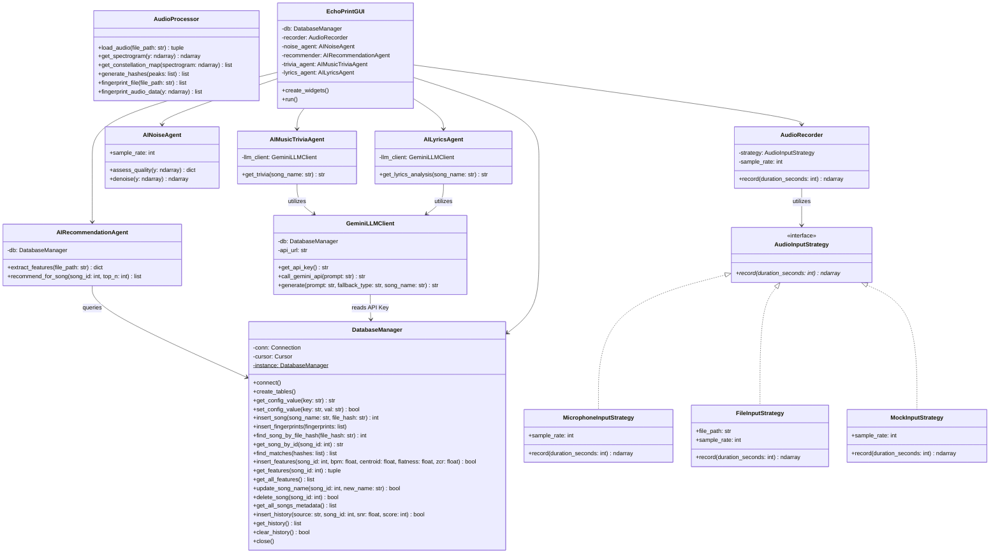

# 🎙️ EchoPrint (Shazam clone)

[](https://www.python.org/)
[](https://www.sqlite.org/)
[](https://docs.python.org/3/library/tkinter.html)
[](https://aistudio.google.com/)
[](https://librosa.org/)

**EchoPrint** is a desktop audio recognition application developed in Python, inspired by the spectral fingerprinting algorithm used by Shazam. The project was built in accordance with academic requirements and software engineering standards for the **Software Development Methods (MDS)** course at FMI Unibuc.

The application scans and "learns" songs from a local music library (generating spectral fingerprints stored efficiently in SQLite), and then identifies in real-time any track played live through the microphone or loaded from an audio file. It also integrates autonomous AI agents to perform background noise mitigation, suggest similar songs, and extract trivia facts, artist biographies, and lyrics sentiments using a Large Language Model (LLM).

---

##  Core Features

The application is structured around four functional pillars:

### 1. Algorithmic Audio Recognition
*   **Flexible Input Strategies**: Record directly from a physical microphone, load an existing audio file (MP3, WAV, FLAC, etc.), or generate a synthetic mock audio stream for testing (implemented via the *Strategy Design Pattern*).
*   **Digital Signal Processing (DSP)**: Utilizes the Fast Fourier Transform (FFT) via the `librosa` library to generate high-fidelity spectrograms.
*   **Constellation Map & Hashing**: Extracts local peaks (maxima) from the spectrogram and pairs them into frequency-time hashes to perform ultra-fast lookups.

### 2. Database Management (CRUD)
*   **Visual Interface**: Display all indexed songs in an interactive Tkinter `Treeview` table.
*   **Dynamic Filtering**: Instantly search and filter the database in real-time as the user types the song name.
*   **Modify & Delete**: Rename song display names or delete songs completely (enforced by SQLite `ON DELETE CASCADE` constraints, which automatically clean up associated fingerprints and features).

### 3. Search History & Monitoring
*   Automatically logs every identification attempt into the `search_history` database table.
*   Tracks technical performance metrics: date/time, audio input source, recognized track, estimated Signal-to-Noise Ratio (SNR), and confidence score (number of matched hashes).
*   Allows the user to clear the entire search history directly from the GUI.

### 4. Artificial Intelligence Agents
The application orchestrates **4 autonomous AI agents** cooperating in a pipeline:
*    **AI Noise Agent (`AINoiseAgent`)**: Evaluates raw audio quality metrics (SNR, RMS, clipping) and removes static background noise using spectral subtraction (*Spectral Gating*) prior to recognition.
*    **AI Recommendation Agent (`AIRecommendationAgent`)**: Extracts tempo (BPM) and spectral features (flatness, centroid, zero-crossing rate) to suggest the top 3 similar tracks in the database using normalized Euclidean distance.
*    **AI Music Trivia Agent (`AIMusicTriviaAgent`)**: Queries the Gemini LLM to generate trivia facts about the song and a concise biography of the artist.
*    **AI Lyrics Agent (`AILyricsAgent`)**: Integrates Gemini LLM to analyze the song's lyrics, determine the dominant sentiment, and output a summary.

---

##  Architecture & Design Patterns

The project follows a modular structure, decoupling responsibilities across packages:

```
PyShazam/
│
├── main.py                # App entry point (CLI parser and GUI launcher)
├── echoprint.db           # Auto-generated SQLite database file
├── requirements.txt       # Python project dependencies
│
├── audio/                 # Package for digital audio processing
│   ├── audio_processor.py # FFT, Constellation Map, and spectral hashing
│   ├── audio_source.py    # Audio input strategies (Strategy Pattern)
│   └── recorder.py        # Utility class for recording audio
│
├── db/                    # Package for data persistence
│   └── db_manager.py      # SQLite database manager (Singleton Pattern)
│
├── ai/                    # Package for AI Agents logic
│   ├── ai_noise_agent.py          # Quality check and spectral denoising
│   ├── ai_recommendation_agent.py # Audio feature extraction and similarity
│   ├── llm_client.py              # Secure HTTP client for Gemini API
│   ├── ai_trivia_agent.py         # Artist trivia and biography agent (LLM)
│   └── ai_lyrics_agent.py         # Lyrics sentiment and analysis agent (LLM)
│
├── gui/                   # Package for desktop graphical interface
│   └── gui.py             # Tkinter desktop GUI with a premium Dark Theme
│
└── tests/                 # Automated unit test suite
    ├── test_audio_processor.py
    ├── test_db_manager.py
    └── test_ai_agents.py
```

### Design Patterns Used:
1.  **Singleton (`DatabaseManager`)**: Ensures a single SQLite connection is instantiated and shared across the entire application, preventing database locks and multithreading write conflicts.
2.  **Strategy (`AudioInputStrategy`)**: Decouples the `AudioRecorder` from the physical audio input. During runtime or testing, the system can inject `MicrophoneInputStrategy`, `FileInputStrategy`, or `MockInputStrategy` without changing the recording code.

### UML Class Diagram:


---

##  Prerequisites & Requirements

Before running the project, make sure you have installed:
*   **Python 3.10+** (downloaded from the official site or Microsoft Store).
*   **FFmpeg** (used behind the scenes by `librosa` / `soundfile` to decode audio formats). The application will automatically attempt to set up a static binary path for FFmpeg using `static_ffmpeg` during the first launch.
*   **Working Microphone** (needed for real-time live audio recognition).
*   *(Optional)* A free **Google Gemini** API Key for actual LLM-powered agents. It can be generated from [Google AI Studio](https://aistudio.google.com/). If no key is set, the application falls back seamlessly to a built-in **offline Mock** mode.

---

##  Installation & Configuration

### Step 1: Navigate to the Project Folder
Open your terminal and change the directory to the project root:

### Step 2: Create and Activate a Virtual Environment (`venv`)
It is recommended to run the app in an isolated virtual environment:
```cmd
# Create venv
python -m venv venv

# Activate venv on Windows (Command Prompt CMD)
venv\Scripts\activate.bat

# Activate venv on Windows (PowerShell)
.\venv\Scripts\Activate.ps1
```

### Step 3: Install Required Dependencies
With the virtual environment active, run pip install:
```cmd
pip install -r requirements.txt
```

### Step 4: Configure Gemini API Key
You can register your API Key directly inside the GUI application:
1. Run the GUI app.
2. Open the **"Setări / Învață Melodii"** (Settings & Learn) tab.
3. Paste the key into the **"Gemini API Key"** input field and click **"Salvează Cheie API"** (Save API Key). It will be saved securely in SQLite and reused for future queries.

---

##  Running the Application

The application can be run in two different modes:

### A. Run in GUI Mode (Desktop Graphical Interface) - Recommended
This is the default mode. Launch the premium Dark Mode desktop GUI by running:
```cmd
python main.py
# or explicitly
python main.py --gui
```

**GUI Usage Guide:**
1.  **Tab 1 (Recunoaștere - Recognition)**: Select your preferred input source (Microphone, File, or Mock input). Click **"Ascultă / Recunoaște"** (Listen / Recognize) to start recording. Once identified, similar recommendations, trivia, and lyrics sentiment analysis will automatically display in the panels below.
2.  **Tab 2 (Administrare DB - DB Management)**: Displays the song catalog. You can filter the table, rename songs, or delete them.
3.  **Tab 3 (Istoric Căutări - Search History)**: Displays previous searches and has a button to clear the logs.
4.  **Tab 4 (Setări & Învățare - Settings & Learning)**: Manage your Gemini API Key and index local folders.

---

### B. Run in CLI Mode (Command Line Interface)
If you prefer the command line, run the following commands:

1.  **Learn Mode (Index local music files)**:
    Scans a directory recursively, extracts fingerprints and features, and saves them into the SQLite database:
    ```cmd
    python main.py learn --dir "C:\Path\To\Music"
    ```
2.  **Listen Mode (Direct terminal recognition)**:
    *   *Via Microphone* (listens for 10 seconds):
        ```cmd
        python main.py listen --duration 10
        ```
    *   *Via Audio File*:
        ```cmd
        python main.py listen --file "C:\Path\To\song.mp3"
        ```
    *   *Via Mock Audio Input* (simulates input signal for headless testing):
        ```cmd
        python main.py listen --mock
        ```

---
